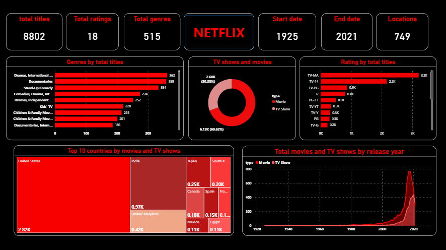

# Netflix Data Analytics Dashboard 📊🎬

This project is an interactive Netflix Dashboard created using Power BI.

## Dashboard Overview
The dashboard provides insights into:
- Movies vs TV Shows distribution
- Genre analysis
- Ratings breakdown
- Country-wise content production
- Release year trends
- Netflix content statistics

## Tools Used
- Power BI
- Data Visualization
- Data Cleaning
- GitHub

## Dashboard Preview

## GitHub Repository
https://github.com/yogiraj-official/netflix-dashboard

## Author
Yogi Raj
